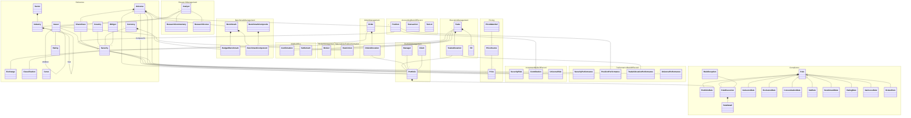

```mermaid
classDiagram
    namespace Reference {
        class Security
        class Issuer
        class Rating
        class Exchange
        class Universe
        class ShareClass
        class Country
        class Currency
        class Classification
        class Sector
        class Industry
        class Curve
        class Obligor
    }
    namespace OrderManagement {
        class Order
        class OrderAllocation
    }
    namespace ExecutionManagement {
        class Trade
        class TradeAllocation
        class Fill
    }
    namespace PortfolioManagement {
        class Portfolio
        class Manager
        class Client
    }
    namespace BenchmarkManagement {
        class Benchmark
        class HedgedBenchmark
        class BenchmarkComponent
        class BenchmarkComposite
    }
    namespace AccountingBookOfRecord {
        class Position
        class Transaction
        class TaxLot
    }
    namespace MiddleOffice {
        class Confirmation
        class Settlement
    }
    namespace BrokerManagement {
        class Broker
    }
    namespace ResearchManagement {
        class Analyst
        class ResearchCommentary
        class ResearchScores
    }
    namespace Pricing {
        class Price
        class PriceSource
        class PriceWaterfall
    }
    namespace InvestmentBookOfRecord {
        class SecurityRisk
        class Contribution
        class UniverseRisk
    }
    namespace PerformanceBookOfRecord {
        class SecurityPerformance
        class PositionPerformance
        class TradeAllocationPerformance
        class UniversePerformance
    }
    namespace Compliance {
        class Rule
        class PortfolioRule
        class RuleExecution
        class RuleException
        class RuleDetail
        class InclusionRule
        class ExclusionRule
        class ConcentrationRule
        class NetRule
        class BenchmarkRule
        class RatingRule
        class GainLossRule
        class BrokerRule
    }
    namespace MaterialNonPublicInformation {
        class Restriction
    }
    Universe <|-- Portfolio
    Universe <|-- Benchmark
    Portfolio -- "*" Universe: CompareTo
    Universe *-- "*" Position
    Position "*" -- Security
    Issuer -- "*" Security
    Issuer o-- Issuer: children
    Trade *-- TradeAllocation
    Trade "*" -- Security
    TradeAllocation "*" -- Portfolio
    Order *-- OrderAllocation
    Order "*" -- Security
    OrderAllocation "*" -- Portfolio
    Issuer "*" -- "*" Rating
    Universe *-- "*" ShareClass
    ShareClass -- Security
    Trade "*" -- Broker
    Security "*" -- Exchange
    Country "*" -- "*" Security
    Currency "*" -- "*" Security
    Manager "*" -- "*" Portfolio
    Analyst "*" -- "*" ResearchCommentary
    Analyst "*" -- "*" ResearchScores
    Analyst "*" -- "*" Issuer
    Security  -- "*" Price
    PriceSource -- "*" Price
    PriceWaterfall -- "*" PriceSource
    Security -- "*" SecurityRisk
    Position -- "*" Contribution
    Universe -- "*" UniverseRisk
    Trade *-- "*" Fill
    Rule *-- PortfolioRule
    Portfolio *-- PortfolioRule
    Rule <|-- InclusionRule
    Rule <|-- ExclusionRule
    Rule <|-- ConcentrationRule
    Rule <|-- NetRule
    Rule <|-- BenchmarkRule
    Rule <|-- RatingRule
    Rule <|-- GainLossRule
    Rule <|-- BrokerRule
    Rule *-- "*" RuleExecution
    RuleExecution *-- "*" RuleDetail
    RuleException -- RuleExecution
    Trade -- Confirmation
    Trade -- Settlement
    Security -- "*" SecurityPerformance
    Position -- "*" PositionPerformance
    Universe -- "*" UniversePerformance
    TradeAllocation -- "*" TradeAllocationPerformance
    Security "*" -- "*" Classification
    Sector *-- "*" Industry
    Industry *-- "*" Industry: Sub
    Analyst "*" -- "*" Industry
    Issuer -- Restriction
    Client -- "*" Portfolio
    Obligor -- "*" Security
    Benchmark *-- "*" HedgedBenchmark
    Currency *-- "*" HedgedBenchmark
    Benchmark "*" *-- BenchmarkComponent
    BenchmarkComposite *-- "*" BenchmarkComponent
```